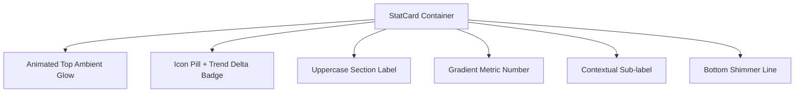

# 👑 GoldCraft / R.K. Jewellers — Design System & UI Specification

> **Theme**: Cyber-Luxury Metallic Gold & Obsidian Dark Mode  
> **Target Platforms**: Android (Capacitor Native), iOS (Capacitor Native), Windows/macOS Desktop (Electron)  
> **Brand Identity**: Modern high-end jewellery POS & inventory workstation for *R.K. Jewellers*.

---

## 1. Visual Philosophy & Core Aesthetics

GoldCraft is crafted with a **Cyber-Luxury Aesthetic** combining the warmth of fine jewellery metals with modern fintech precision:

1. **Deep Obsidian Foundation**: Backgrounds leverage `#05030f` to `#0f0b1e` to provide high contrast, making gold and jewelry gemstones pop.
2. **Metallic Gold Gradients**: Primary accents use multi-stop gradients (`#fbbf24` → `#f59e0b` → `#d97706`) rather than flat yellows.
3. **Glassmorphism & Depth**: Surfaces utilize subtle backdrop blurs (`backdrop-filter: blur(20px)`), highlight lines (`inset 0 1px 0 rgba(255,255,255,0.06)`), and glow halos.
4. **Fluid Motion & Micro-Animations**: Smooth cubic-bezier transitions (`0.2s cubic-bezier(0.4, 0, 0.2, 1)`), floating ambient glow spheres, and spring-based modal entrances.
5. **Mobile Ergonomics**: Full viewport accessibility with sticky action bars, bottom sheet dialogs, and a floating iOS-style blur dock.

---

## 2. Color Palette & Tokens

### 🪙 Metallic Gold Accent
| Token | Hex / Value | Purpose |
|---|---|---|
| `--gold-50` | `#fffbee` | Ultra-light text highlights |
| `--gold-100` | `#fef3c7` | High-emphasis headers / numbers |
| `--gold-200` | `#fde68a` | Active icons, customer names |
| `--gold-300` | `#fbbf24` | Primary brand accent & focus rings |
| `--gold-400` | `#f59e0b` | Borders, secondary badges |
| `--gold-500` | `#d97706` | Button gradient endpoints |
| `--gold-600` | `#b45309` | Dark borders & active shadows |

### 🌌 Obsidian Dark Base
| Token | Hex / Value | Purpose |
|---|---|---|
| `--bg-base` | `#05030f` | Main app background canvas |
| `--bg-surface` | `#0a0718` | Sidebars, titlebars, and modal headers |
| `--bg-card` | `#0f0b1e` | Stat cards, table containers |
| `--bg-card-hover` | `#18122e` | Interactive hover surface |
| `--bg-input` | `rgba(255, 255, 255, 0.05)` | Glassmorphic input fields |

### 🚨 Semantic & Analytics Accents
| Accent | Main Color | Glow / Badge Background |
|---|---|---|
| **Revenue / Gold** | `#fbbf24` | `rgba(251, 191, 36, 0.15)` |
| **Success / Paid** | `#10b981` | `rgba(16, 185, 129, 0.15)` |
| **Dues / Danger** | `#f43f5e` | `rgba(244, 63, 94, 0.15)` |
| **Clients / Info** | `#818cf8` | `rgba(129, 140, 248, 0.15)` |
| **Pending / Warning** | `#fb923c` | `rgba(251, 146, 60, 0.15)` |

---

## 3. Typography & Font Hierarchy

The typography pairs a clean sans-serif for numbers/data with an editorial serif for branding:

```
Headings & Display:  'Outfit', sans-serif (Weights: 700, 800, 900)
Body & Data Forms:   'Inter', system-ui, sans-serif (Weights: 400, 500, 600, 700)
Luxury Brand Marks:  'Cinzel', serif (Weights: 700, 800)
```

### Type Scale
- **Hero Title**: `32px` / `900` weight / `-0.8px` tracking (`Outfit`)
- **Card Numbers**: `27px` / `900` weight with linear gradient fill (`Outfit`)
- **Section Headers**: `10.5px` / `800` weight / `1.2px` uppercase letter-spacing
- **Body & Form Text**: `14px` / `500` weight (`Inter`)
- **Labels & Micro-copy**: `11px` / `600` weight

---

## 4. Component Architecture

### 📊 1. Gradient Stat Cards
- **Structure**: Rounded card (`border-radius: 20px`) with multi-color radial gradient corner light.
- **Top Bar**: Glass badge icon with matching neon halo + percentage delta badge.
- **Value**: Dual-stop linear gradient text (White → Accent Color).
- **Bottom Rim**: Glowing 2px gradient accent line.



### 🧾 2. Full-Screen Billing Workstation (`BillModal`)
- **Header**: Fixed top row (`flex-wrap: nowrap`) with diamond icon, invoice type, customer tag, and circular glass close button `[✕]`.
- **Items Grid (Desktop)**: Tabular layout with real-time rate auto-calculation.
- **Items Cards (Mobile)**: Stacked cards with gold micro-labels for every input field (Type, Purity, Qty, Weight, Rate, Making).
- **Sticky Footer (Mobile)**: Gradient background pinned at bottom with a high-contrast action button.

### 📱 3. Floating Bottom Dock (Mobile Navigation)
- **Position**: Floating dock `fixed` at the bottom with `12px` screen margins and `22px` border radius.
- **Backdrop**: `rgba(8, 5, 18, 0.94)` with `backdrop-filter: blur(30px) saturate(180%)`.
- **Active State**: Gold gradient pill with subtle gold ring glow (`box-shadow: 0 0 16px rgba(251,191,36,0.2)`).

---

## 5. Animation & Micro-Interactions

| Animation Name | Keyframe Behavior | Applied To |
|---|---|---|
| `pulse-glow` | Expands and contracts box-shadow opacity | Live status dot, focus rings |
| `float-up` | Gentle floating motion (`translateY(-6px)`) | Ambient background spheres |
| `gradient-shift` | Smooth 4s position shift on gradient | `.btn-primary` CTA buttons |
| `fade-in-up` | Opacity `0 → 1` with `translateY(16px → 0)` | Modal popups, navigation dock |
| `shimmer` | Sweeps white gloss sheen across surface | Button hover overlay |

---

## 6. Mobile Optimization Guidelines

1. **Zero Tap Flashes**: `-webkit-tap-highlight-color: transparent !important;` prevents browser tap boxes on iOS/Android.
2. **Page Viewport Clearances**: Every `.page` maintains `padding-bottom: 96px` to prevent bottom floating navigation overlap.
3. **Touch Targets**: All buttons, select menus, and icons satisfy minimum 44×44px interactive bounds.
4. **Keyboard Management**: Form dialogs use `max-height: 90dvh` and `-webkit-overflow-scrolling: touch` to ensure scrollability when the software keyboard is active.
